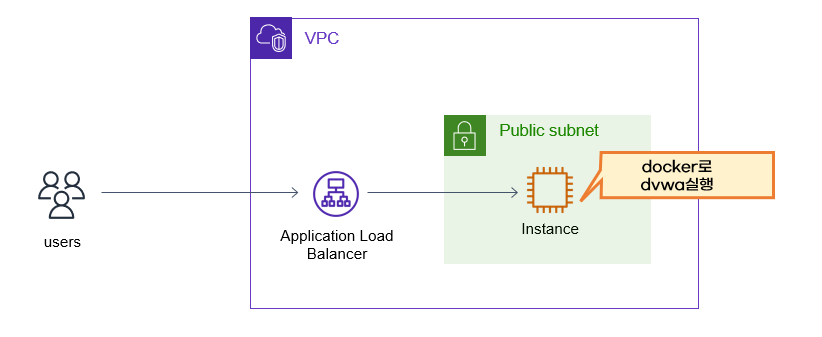
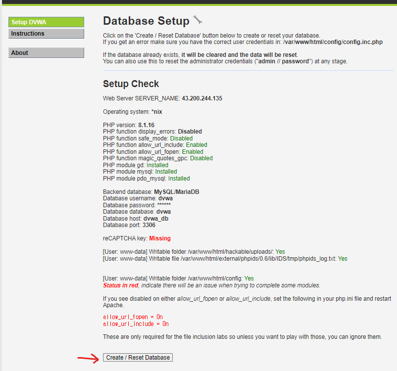

# 개요
* aws waf 실습
* 블로그 정리: https://malwareanalysis.tistory.com/650
* 실습영상 유투브 링크: https://youtu.be/fweHx0vFCS8?si=qFTz_zSnXxpBSj-N

# 실습 환경 구축
> 한달기준 가격은 약 $33



* 테라폼으로 aws 리소스 생성
* aws alb dns 주소 접속
```bash
terraform output
```

* dvwa 로그인(id/pw: admin/p@ssw0rd)
* dvwa DB 초기화



* dvwa 다시 로그인(id/pw: admin/password)
